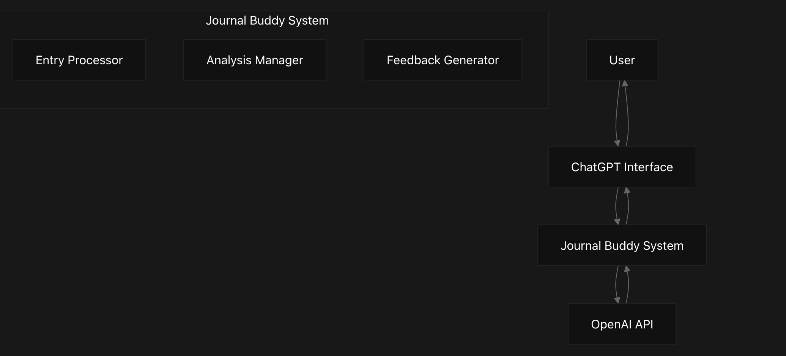
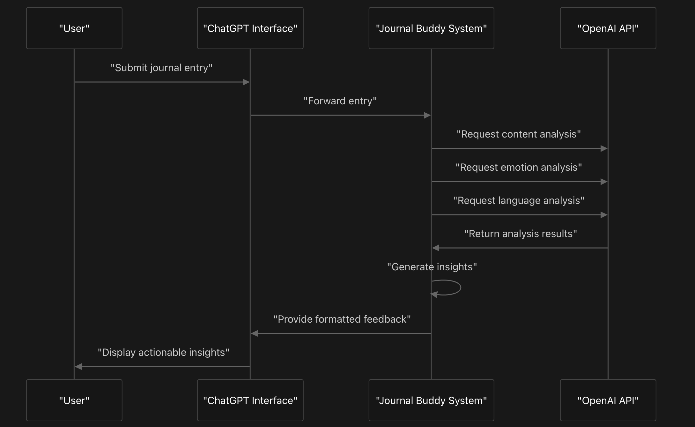
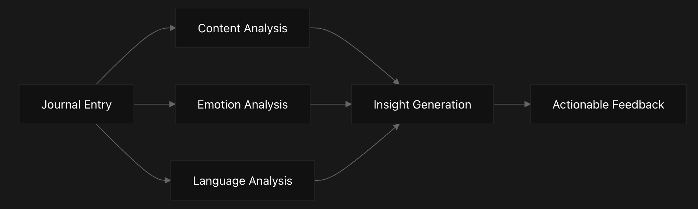
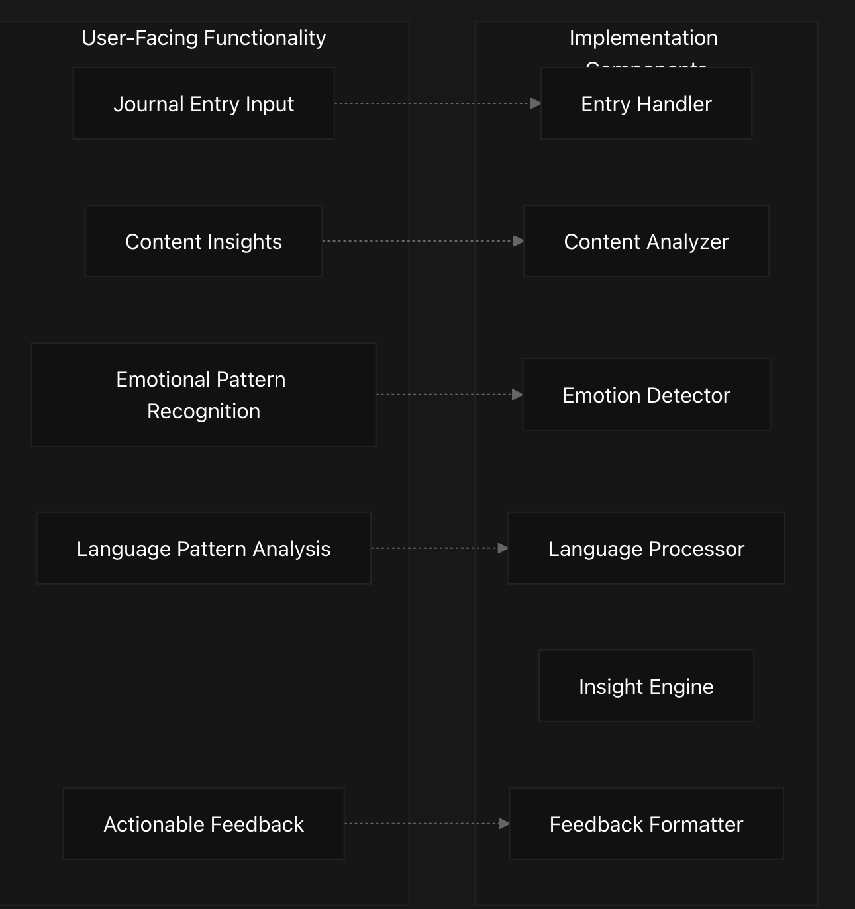
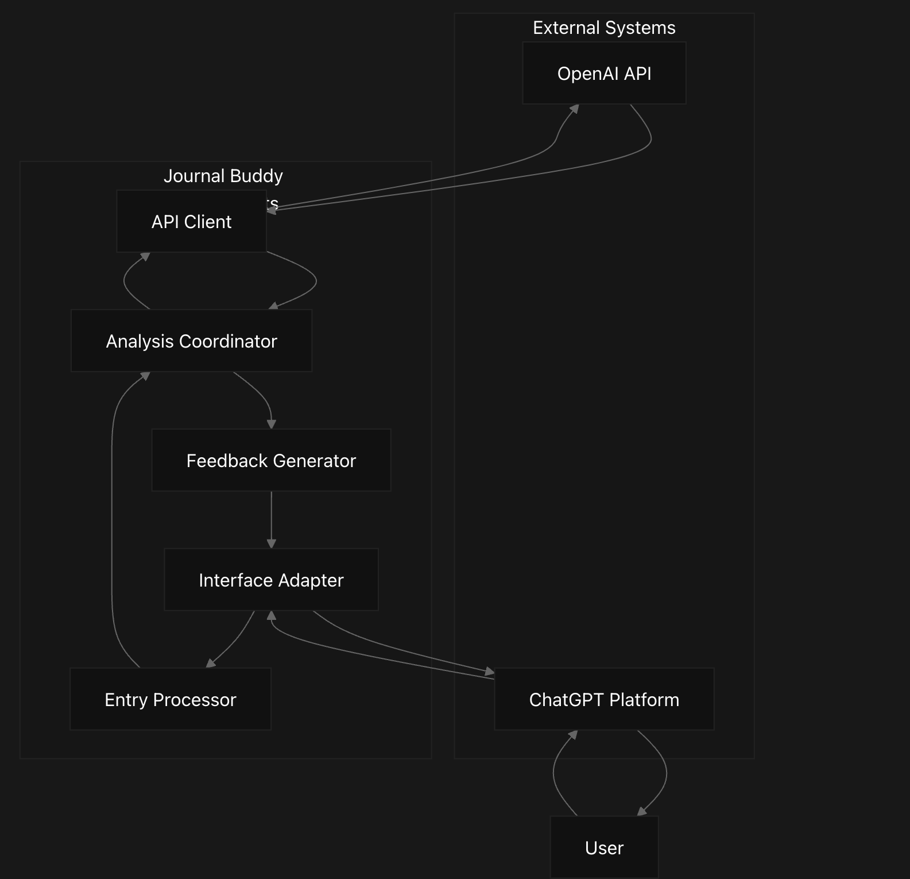
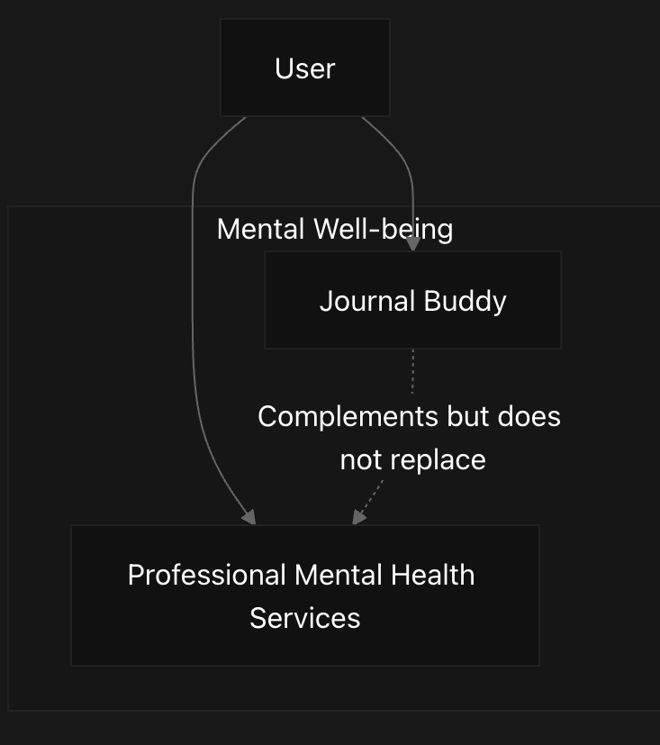

# Journal Buddy Overview
This document provides a comprehensive introduction to the Journal Buddy system, a Python-based tool that leverages the OpenAI API to analyze journal entries and provide users with actionable feedback for self-reflection and personal growth.

## System Purpose
Journal Buddy addresses the challenge of obtaining meaningful feedback on personal journal entries by implementing automated analysis of content, emotion, and language patterns. Unlike traditional journaling where entries remain unexamined, Journal Buddy provides AI-powered insights that enhance self-reflection.

As explicitly noted in the system documentation, Journal Buddy is **not** intended to replace professional mental health services but rather to complement them.

## System Architecture Diagram

## User Interaction Flow Diagram

## Data Processing Pipeline Diagram

This diagram illustrates how Journal Buddy processes user input through parallel analysis paths before integrating results to generate actionable feedback.

## Code to System Function Mapping Diagram

This diagram maps user-facing features to their likely implementation components within the Journal Buddy system.

## System Interaction Context Diagram

This diagram shows how Journal Buddy integrates with external systems and how data flows between components during processing.

## Key Components
Component	            Function	                    Role in System
ChatGPT Interface	    User interaction portal	      Collects journal entries and displays feedback
API Client	          OpenAI API integration	      Handles API requests and responses for analysis
Entry Processor	      Text preprocessing	          Prepares raw journal text for analysis
Analysis Coordinator	Analysis orchestration	      Coordinates multiple analysis dimensions
Feedback Generator	  Insight compilation	          Transforms analysis results into actionable feedback
Interface Adapter	    Response formatting	          Adapts feedback for display in ChatGPT interface

## System Context and Limitations
Journal Buddy serves as a complementary tool within a broader mental health ecosystem:

The system explicitly acknowledges its limitations as stated in the documentation: "JOURNAL BUDDY IS NOT AND DOES NOT CLAIM TO BE A REPLACEMENT FOR A LICENSED MENTAL HEALTH PROFESSIONAL."

## Access and Usage
Journal Buddy is accessible through a ChatGPT interface at: https://chat.openai.com/g/g-Z1wv8Hojg-journal-buddy

This project served as my Northwestern University Master of Data Science Capstone Project in 2023.
!!!!JOURNAL BUDDY IS NOT AND DOES NOT CLAIM TO BE A REPLACEMENT FOR A LICENSED MENTAL HEALTH PROFESSIONAL!!!!
